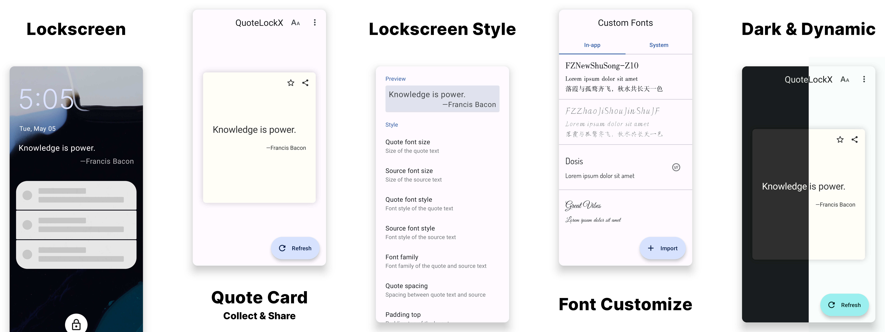
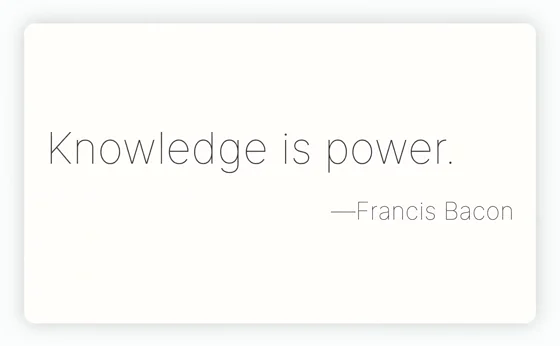
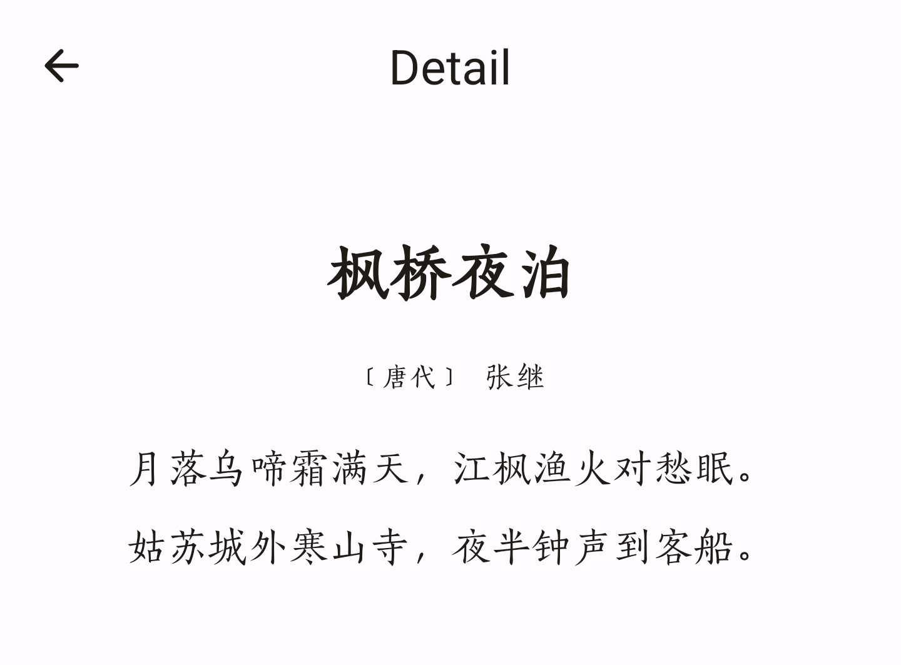

![QuoteLockX](https://socialify.git.ci/Yubyf/QuoteLockX/image?description=1&font=Jost&forks=1&issues=1&logo=data%3Aimage%2Fsvg%2Bxml%3Bbase64%2CPD94bWwgdmVyc2lvbj0iMS4wIiBlbmNvZGluZz0iVVRGLTgiPz4KPHN2ZyB3aWR0aD0iNjBweCIgaGVpZ2h0PSI2MHB4IiB2aWV3Qm94PSIwIDAgNjAgNjAiIHZlcnNpb249IjEuMSIgeG1sbnM9Imh0dHA6Ly93d3cudzMub3JnLzIwMDAvc3ZnIiB4bWxuczp4bGluaz0iaHR0cDovL3d3dy53My5vcmcvMTk5OS94bGluayI%2BCiAgICA8ZyBpZD0iUGFnZS0xIiBzdHJva2U9Im5vbmUiIHN0cm9rZS13aWR0aD0iMSIgZmlsbD0ibm9uZSIgZmlsbC1ydWxlPSJldmVub2RkIj4KICAgICAgICA8ZyBpZD0iYWRhcHRpdmUtaWNvbiIgdHJhbnNmb3JtPSJ0cmFuc2xhdGUoLTI0LjAwMDAwMCwgLTI0LjAwMDAwMCkiPgogICAgICAgICAgICA8ZyBpZD0iZm9yZWdyb3VuZCIgdHJhbnNmb3JtPSJ0cmFuc2xhdGUoMC4wMDAwMDAsIDAuMDAwMDAwKSI%2BCiAgICAgICAgICAgICAgICA8cGF0aCBkPSJNNTQuNSwyOSBDNjAuNTM3NSwyOSA2NS40Mzc1LDMzLjg1MzMzMzMgNjUuNDM3NSwzOS44MzMzMzMzIEw2NS40Mzc1LDQ0LjE2NjY2NjcgTDY3LjYyNSw0NC4xNjY2NjY3IEM3MC4wMzEyNSw0NC4xNjY2NjY3IDcyLDQ2LjExNjY2NjcgNzIsNDguNSBMNzIsNzAuMTY2NjY2NyBDNzIsNzIuNTUgNzAuMDMxMjUsNzQuNSA2Ny42MjUsNzQuNSBMNDEuMzc1LDc0LjUgQzM4Ljk2ODc1LDc0LjUgMzcsNzIuNTUgMzcsNzAuMTY2NjY2NyBMMzcsNDguNSBDMzcsNDYuMTE2NjY2NyAzOC45Njg3NSw0NC4xNjY2NjY3IDQxLjM3NSw0NC4xNjY2NjY3IEw0My41NjI1LDQ0LjE2NjY2NjcgTDQzLjU2MjUsMzkuODMzMzMzMyBDNDMuNTYyNSwzMy44NTMzMzMzIDQ4LjQ2MjUsMjkgNTQuNSwyOSBaIE01MS42ODc1LDU0IEw0Ny45Mzc1LDU0IEM0Ny40MjE4NzUsNTQgNDcsNTQuNDIxODc1IDQ3LDU0LjkzNzUgTDQ3LDU4LjY4NzUgQzQ3LDU5LjIwMzEyNSA0Ny40MjE4NzUsNTkuNjI1IDQ3LjkzNzUsNTkuNjI1IEw0OS44MTI1LDU5LjYyNSBMNDguODQ2ODc1LDYxLjU1NjI1IEM0OC40MjUsNjIuMzkwNjI1IDQ5LjAzNDM3NSw2My4zNzUgNDkuOTcxODc1LDYzLjM3NSBDNTAuNDUsNjMuMzc1IDUwLjg5MDYyNSw2My4xMDMxMjUgNTEuMDk2ODc1LDYyLjY4MTI1IEw1Mi40MjgxMjUsNjAuMDE4NzUgQzUyLjU1OTM3NSw1OS43NTYyNSA1Mi42MjUsNTkuNDc1IDUyLjYyNSw1OS4xODQzNzUgTDUyLjYyNSw1NC45Mzc1IEM1Mi42MjUsNTQuNDIxODc1IDUyLjIwMzEyNSw1NCA1MS42ODc1LDU0IFogTTYxLjA2MjUsNTQgTDU3LjMxMjUsNTQgQzU2Ljc5Njg3NSw1NCA1Ni4zNzUsNTQuNDIxODc1IDU2LjM3NSw1NC45Mzc1IEw1Ni4zNzUsNTguNjg3NSBDNTYuMzc1LDU5LjIwMzEyNSA1Ni43OTY4NzUsNTkuNjI1IDU3LjMxMjUsNTkuNjI1IEw1OS4xODc1LDU5LjYyNSBMNTguMjIxODc1LDYxLjU1NjI1IEM1Ny44LDYyLjM5MDYyNSA1OC40MDkzNzUsNjMuMzc1IDU5LjM0Njg3NSw2My4zNzUgQzU5LjgyNSw2My4zNzUgNjAuMjY1NjI1LDYzLjEwMzEyNSA2MC40NzE4NzUsNjIuNjgxMjUgTDYxLjgwMzEyNSw2MC4wMTg3NSBDNjEuOTM0Mzc1LDU5Ljc1NjI1IDYyLDU5LjQ3NSA2Miw1OS4xODQzNzUgTDYyLDU0LjkzNzUgQzYyLDU0LjQyMTg3NSA2MS41NzgxMjUsNTQgNjEuMDYyNSw1NCBaIE01NC4wNjI1LDMzLjM3NSBDNTAuNDQyNTQwMywzMy4zNzUgNDcuNSwzNi40NzUyNDUxIDQ3LjUsNDAuMjg5MjE1NyBMNDcuNSw0NC43NSBMNjAuNjI1LDQ0Ljc1IEw2MC42MjUsNDAuMjg5MjE1NyBDNjAuNjI1LDM2LjQ3NTI0NTEgNTcuNjgyNDU5NywzMy4zNzUgNTQuMDYyNSwzMy4zNzUgWiIgaWQ9IuW9oueKtue7k%2BWQiCIgZmlsbD0iIzM1NUNBOCI%2BPC9wYXRoPgogICAgICAgICAgICAgICAgPHJlY3QgaWQ9ImZpbmlzaCIgZmlsbD0idXJsKCNyYWRpYWxHcmFkaWVudC0xKSIgeD0iMCIgeT0iMCIgd2lkdGg9IjEwOCIgaGVpZ2h0PSIxMDgiPjwvcmVjdD4KICAgICAgICAgICAgPC9nPgogICAgICAgIDwvZz4KICAgIDwvZz4KPC9zdmc%2B&name=1&pattern=Charlie%20Brown&stargazers=1&theme=Light)

Welcome to QuoteLockX, a fork of the original [QuoteLock](https://github.com/apsun/QuoteLock) module
designed to display quotes on your lock screen for a little bit of inspiration and motivation
throughout the day. This fork is continuously maintained as the
original [QuoteLock](https://github.com/apsun/QuoteLock) is no longer actively maintained and has
been archived.

This module is available in
LSPosed [Repository](https://modules.lsposed.org/module/com.yubyf.quotelockx) now.

## Features

- Displays quotes on your lockscreen, because why not.
- Customizes the quotes style.
- Shares the quote card to other apps.
- Collects your favorite quotes.
- Records the quote history that you can always look up old entries.
- Import/Export collections in .db or .csv format on local storage.
- Backup/Restore collections on Google Drive.
- Displays quotes on the AmbientDisplay page of *OnePlus7Pro OOS11* (**ALPHA**)
- Imports custom fonts ([Magisk module](https://github.com/Yubyf/QuoteLockX-CustomFonts) needed for
  lockscreen layout).
- Support for variable font weight and slant axis properties.
- Support for quote detail pages for some providers (currently only supported by Jinrishici).
- Support for widget.

## Tips

Long press on the quotes to show refresh and collect buttons:

## Notice

**Only near-AOSP Android ROMs are supported!** This is due to the heavy lockscreen modifications
made by different OEMs.
(This app is also compatible with the official MIUI14 on default lockscreen confirmed by community
members.)

**After installing, please open the app at least once** to allow the quote downloader service to run
in the background.

**Make sure to whitelist QuoteLockX if you are using a task-killer app!** They can interfere with
the download service.

## Requirements

- A rooted phone running Android 5.0 or above
- Xposed framework

## Providers

- [Hitokoto CN (中文)](http://hitokoto.cn/)
- [Wikiquote QotD (multilingual)](https://www.wikiquote.org/)
- [Jinrishici 今日诗词 (中文)](https://www.jinrishici.com/)
- [Freakuotes (Español)](https://freakuotes.com/)
- [Natune.net (Deutsch)](https://natune.net/zitate/)
- [BrainyQuote (English)](https://www.brainyquote.com/)
- [Lib Quotes (English)](https://libquotes.com/)
- [Fortune-mod (multilingual)](https://github.com/shlomif/fortune-mod/)
- [OpenAI (multilingual)](https://openai.com/)
- Custom (write your own!)
- Collections (your favorites)

## TODO

### Todo

- [ ] Show on status bar.

### In Progress

### Done

- [x] Add support for Chinese.
- [x] Add support for custom fonts.
- [x] Optimize lockscreen layout.
- [x] Optimize style for Android S(dynamic colors).
- [x] Refactor the settings page.
- [x] Completely redesigned the app.
- [x] Add support for multi-classification selection of Hitokoto.
- [x] Optimize for variable fonts.
- [x] Advanced detail pages (currently only supported by Jinrishici).
- [x] Add support for widget.
- [x] Add support for in-app upgrades.

## License

Distributed under the [MIT License](http://opensource.org/licenses/MIT).
