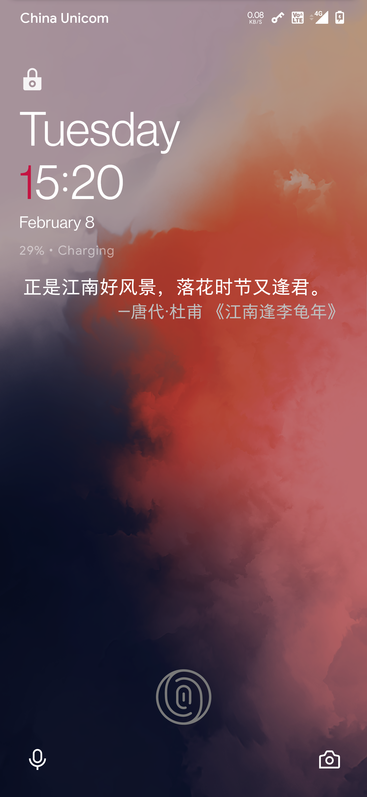
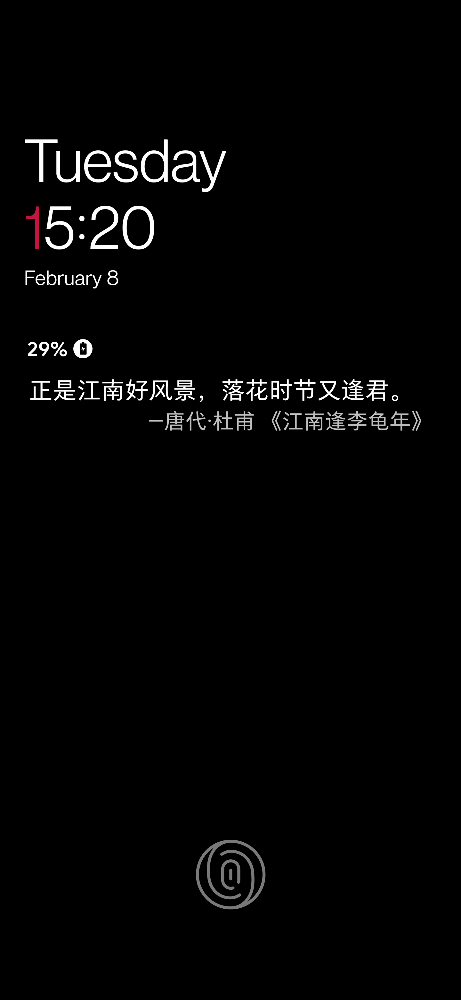
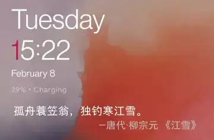

# QuoteLock

This fork will be continuously maintained as
the [original repository](https://github.com/apsun/QuoteLock) is no longer maintained and has been
archived.

## Feature

- Displays quotes on your lockscreen, because why not.
- Customizes the quotes style.
- Collects your favorite quotes.
- Records the quote history that you can always look up old entries.
- Backup and restore collections on local and remote(Google Drive).
- Displays quotes on the AmbientDisplay page of *OnePlus7Pro OOS11* (**UNSTABLE**)

## Screenshots

| Lockscreen | AmbientDisplay |
| :---: | :---: |
|  |  |

Long press on the quotes to show the refersh and collect buttons:

## Notice

**Only near-AOSP Android ROMs are supported!** This is due to the heavy lockscreen modifications
made by different OEMs.

**After installing, please open the app at least once** to allow the quote downloader service to run
in the background.

**Make sure to whitelist QuoteLock if you are using a task-killer app!** They can interfere with the
download service.

## Requirements

- A rooted phone running Android 5.0 or above
- Xposed framework

## Providers

- [Visual Novel as a Service (Invalid) (日本語)](http://vnaas.apsun.xyz/)
- [Hitokoto (unofficial) (中文)](http://hitokoto.cn/)
- [Wikiquote QotD (中文)](https://www.wikiquote.org/)
- [Jinrishici 今日诗词 (中文)](https://www.jinrishici.com/)
- [Freakuotes (Español)](https://freakuotes.com/)
- [Natune.net (Deutsch)](https://natune.net/zitate/)
- [BrainyQuote (English)](https://www.brainyquote.com/)
- Custom (write your own!)
- Collections (your favorites)

## TODO

### Todo

- [ ] Quotes preview in setting page

### In Progress

- [ ] Refactor with Kotlin

### Done

- [x] Material design of setting pages.
- [x] Providers updates
- [x] Jirishici(今日诗词) source
- [x] Backup and restore on local and remote(Google Drive)
- [x] Refresh and collection feature on lockscreen
- [x] Font family and style support
- [x] Adaptation for the AmbientDisplay page of *OnePlus7Pro OOS11* (**UNSTABLE**)
- [x] Auto-sync for remote backup accounts

## License

Distributed under the [MIT License](http://opensource.org/licenses/MIT).
