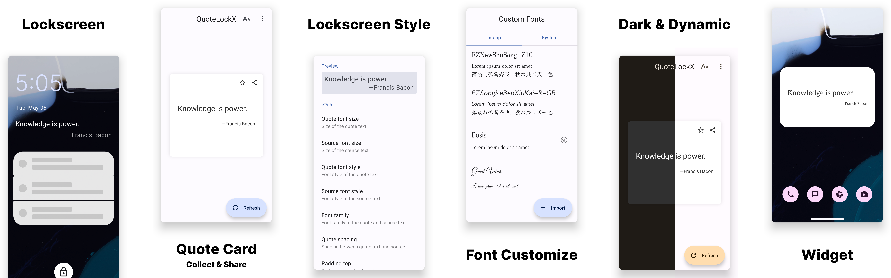

# QuoteLockX

This new fork will be continuously maintained as the
original [QuoteLock](https://github.com/apsun/QuoteLock) is no longer maintained and has been
archived.

This module is available in
LSPosed [Repository](https://modules.lsposed.org/module/com.yubyf.quotelockx) now.

## Features

- Displays quotes on your lockscreen, because why not.
- Customizes the quotes style.
- Shares the quote card to other apps.
- Collects your favorite quotes.
- Records the quote history that you can always look up old entries.
- Import/Export collections in .db or .csv format on local storage.
- Backup/Restore collections on Google Drive.
- Displays quotes on the AmbientDisplay page of *OnePlus7Pro OOS11* (**ALPHA**)
- Imports custom fonts ([Magisk module](https://github.com/Yubyf/QuoteLockX-CustomFonts) needed for
  lockscreen layout).
- Support for variable font weight and slant axis properties.

## Tips

Long press on the quotes to show refresh and collect buttons:

## Notice

**Only near-AOSP Android ROMs are supported!** This is due to the heavy lockscreen modifications
made by different OEMs.

**After installing, please open the app at least once** to allow the quote downloader service to run
in the background.

**Make sure to whitelist QuoteLockX if you are using a task-killer app!** They can interfere with
the download service.

## Requirements

- A rooted phone running Android 5.0 or above
- Xposed framework

## Providers

- [Hitokoto CN (中文)](http://hitokoto.cn/)
- [Wikiquote QotD (中文)](https://www.wikiquote.org/)
- [Jinrishici 今日诗词 (中文)](https://www.jinrishici.com/)
- [Freakuotes (Español)](https://freakuotes.com/)
- [Natune.net (Deutsch)](https://natune.net/zitate/)
- [BrainyQuote (English)](https://www.brainyquote.com/)
- [Lib Quotes (English)](https://libquotes.com/)
- [Fortune-mod (multilingual)](https://github.com/shlomif/fortune-mod/)
- Custom (write your own!)
- Collections (your favorites)

## TODO

### Todo

- [ ] Add support for custom importing of fortune cookies.

### In Progress

- [ ] Advanced detail pages.

### Done

- [x] Add support for Chinese.
- [x] Add support for custom fonts.
- [x] Optimize lockscreen layout.
- [x] Optimize style for Android S(dynamic colors).
- [x] Refactor the settings page.
- [x] Completely redesigned the app.
- [x] Add support for multi-classification selection of Hitokoto.
- [x] Optimize for variable fonts.

## License

Distributed under the [MIT License](http://opensource.org/licenses/MIT).
